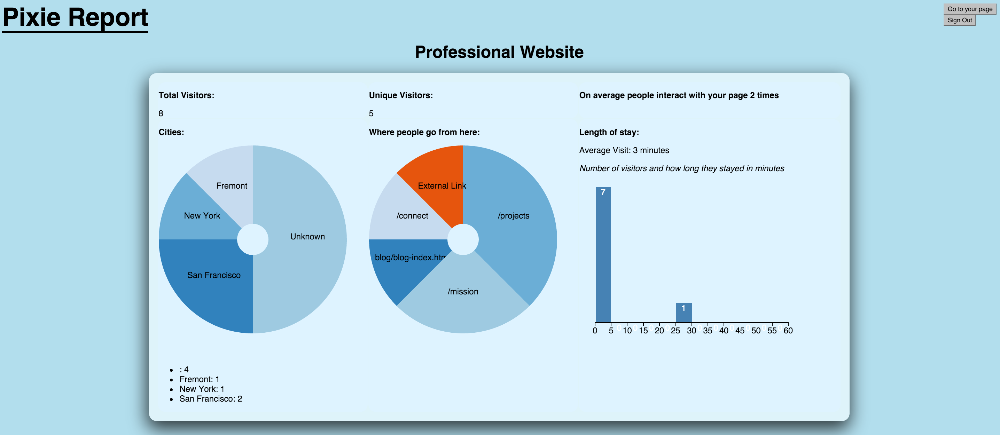

# Pixie Report

Pixie report is a user analytics site which focuses on usability and ease of implementation.

The ideal user for the application -espeically at its instantiation - is a small business owner, the blogger, and the personal brand.

### User Stories:

 - [Who will use it](user_stories.md) - Read about the type of users and what tools they will be able to use for the different tiers - Freemium Pixie, Manic Pixie, and Dream Girl (the latter two are to be established)

 - [How they'll use it](user_story_on_site.md) - Read about the ideal user interface and the user experience

Currently the site is hosted on heroku at:

[PixieReport.herokuapp.com](http://pixiereport.herokuapp.com)

#### Login:
username: demo@abc.com
password: password

